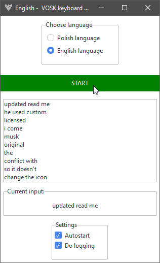

# VOSK keyboard proxy

A simple application that allow dictating text in into input fields system wide across all windows and applications. 

 

Currently two languages are supported: polish (my native language) and english.

> But it's easy to extend the application to use other languages.

# Description

The application is written in Python's 3.12.4, using tkinter for simple user interface as a solution to issue commands to the application.
The backend used for voice to text conversion is VOSK library.
Also the application allows to log the text dictated (by default when the logging is enabled - it logs what has been said to *text_log.txt* file in the installation directory).

# Installation

In order to install this application you need to clone it into your local file system,
install the required dependencies and run using Python by issuing the following command:
`python recognize.py`. 

## Dependencies

The dependencies (modules) are:
- vosk 0.3.45
- pillow 10.4.0 
- keyboard 0.13.5
- pywinauto 0.6.8
- sounddevice 0.4.7
- pyperclip 1.9.0
- ttkbootstrap 1.10.1

In order to install them all in one go, issue the following command to the command line (provided that you have python on the PATH - most probably you do):

`python -m pip install vosk keyboard pywinauto sounddevice pyperclip ttkbootstrap`

or use the provided *requirements.txt* to install files by pip

This application also depends on the recognition models: polish and english, 
so you will have to manually install these models alongside with VOSK.

# Usage

Run the application, choose the language you want and press the start button.
In order to start dictating press control key (left or right) and speak to the microphone.
After you have finished dictating release the control key on the keyboard - the dictated text will get sent to the operating system, acting the same way as if real keyboard keys were pressed.

:warning: If the text doesn't appear try releasing the control key a little bit later.

## Smaller features

### Languages switching
By saying "to polish" when in english - the application will switch to polish language; analogously, by saying "po angielsku" while in polish, the obligation we switched to english language. 
Actually this works without holding the control key.

### Copy inserted text
You can double click on the dictated sentences in the inputed items list and by so copy the contents of the item to the keyboard.

### Autostart
When the "autostart" toggle button is checked the application automatically starts listening after it is run.

### Logging
You can enable or disable the logging using their checkbox labelled "logging".
The logged text is saved in **text_log.txt** file, in the current directory, the directory that application is running in.

### Words remap and other unmentioned
by saying some words separated by a pause - you can insert other symbols:

- "period" -> "."
- "comma" -> "."
- "semicolon" -> ";"

this also has polish counterparts, "kropka", "średnik", etc..
See the code for details.

the last input can be removed by saying "back".

FUTURE NOT A BUG: To exit the application you have to press down the close button twice or  hit the big red exit. it's my personal solution for not closing the window by accident. :sweat_smile:

### Fun fact

**This readme file was written using this application.**

## Issues

The voice recognition isn't perfect - especially switching between languages is faulty and requires some patience.
